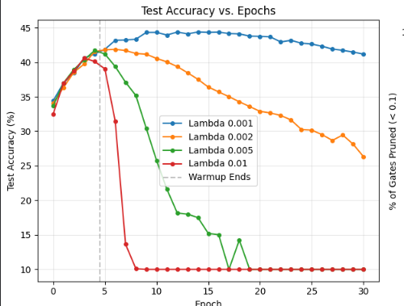
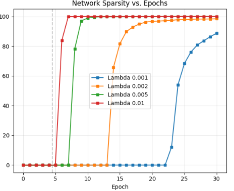
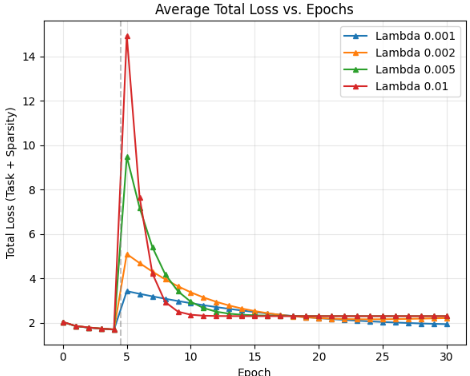
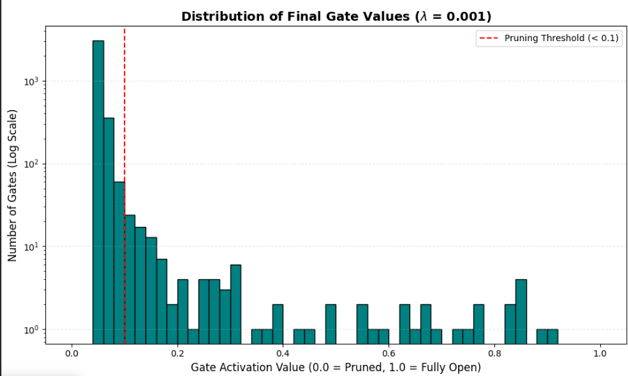

# L1 Regularization and Sparsity
The L1 regularization was applied internally in the training loop to optimize the accuracy and sparsity levels of the neural network, the CIFAR-10 consists of images of 10 different labels which consist of certain hidden features that are to be 
captured by the neural layer to assist in image classification. Each and every pixel is associated with a gradient and the relevance of the particular pixel determines whether the particular pixel/feature is to be pruned. The feature of L1 regularization
to constantly reduce the scores of the gate for every batch plays a role in L1 regularization increasing sparsity. The sigmoid function thereby recieves negative values that have been constantly regularized and therefore sparsity is encouraged while
using L1 regularization 

| Lambda (λ)              | Test Accuracy (%) | Sparsity Level (%) |
|------------------------|------------------|--------------------|
| 0.001                  | 41.17%           | 88.77%             |
| 0.002                  | 26.34%           | 98.44%             |
| 0.005                  | 10.00%           | 100.00%            |
| 0.01                   | 10.00%           | 100.00%            |

Libraries Used -> NumPy, MatplotLib, Tensorflow Datasets ( For Importing Cifar-10)

Pre Processing Steps -> Flattening of the image, Normalization and One Hot-Encoding 
The preprocessing steps were undertaken to ensure compatability with the feedforward neural network layer

| Category           | Hyperparameter            | Value                                   | Rationale / Description                                                                 |
|--------------------|---------------------------|------------------------------------------|------------------------------------------------------------------------------------------|
| Architecture       | Input Dimensions          | 3072                                     | Flattened 32×32×3 CIFAR-10 image                                                         |
| Architecture       | Hidden Layer Size         | 512                                      | Provides enough capacity to learn while leaving room for heavy pruning                   |
| Architecture       | Output Dimensions         | 10                                       | The 10 classification categories of CIFAR-10                                             |
| Training           | Total Epochs              | 30                                       | Provides enough time to observe the full life-cycle of the "runaway train" collapse      |
| Training           | Batch Size                | 128                                      | Standard balance between training speed and gradient stability                           |
| Optimization       | Optimizer_acc             | SGD                                      | Chosen for manual implementation simplicity and reliable convergence                     |
| Optimization       | Weight Learning Rate      | 0.005                                    | Standard speed for updating the core network parameters                                  |
| Optimization       | Momentum                  | 0.9                                      | Helps the network push through local minima during the heavy L1 tax phases               |
| Pruning Dynamics   | Gate Learning Rate        | 0.3                                      | Crucial: Aggressively high to force rapid, visible gate closure                          |
| Pruning Dynamics   | Warmup Epochs             | 5                                        | Allows the network to map basic features before the L1 tax disrupts the weights          |
| Pruning Dynamics   | Sparsity Threshold        | < 0.1                                    | Gates passing <10% of signal are considered "Pruned"                                     |
| Pruning Dynamics   | L1 Penalties (λ)          | [0.0, 0.001, 0.002, 0.005, 0.01]         | Values used for ablation study to map the sensitivity curve                              |

The following results were obtained

# Observations
- Higher Lambda values lead to larger sparsity levels
- Larger gate learning rates lead to faster convergence of sparsity
- Total loss obtained from the equation ( Total Loss = ClassificationLoss + λ * SparsityLoss) is maintained while trying to maintain Sparsity levels and Accuracy Levels
- Higher Sparsity levels lead to decrease in Accuracy despite a maintained total loss
  

## Results

### Test Accuracy vs Epochs

### Sparsity vs Epochs

### Total Loss vs Epochs

### Distribution of Final Gate Values

